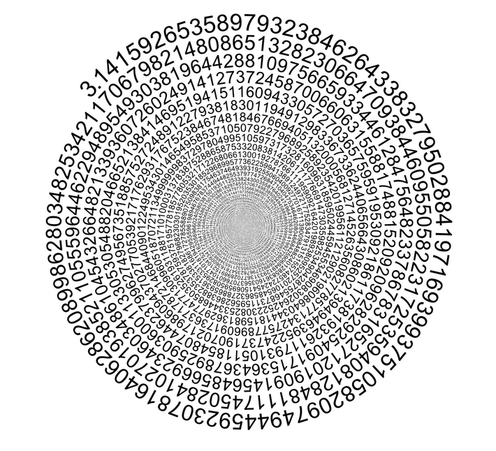

# Awesome - $\pi$

## Overview
$\pi$ is probably the best-known mathematical constant in the world, so famous that it even has a dedicated day (March 14th).
It's defined as the ratio between a circumference and its diameter and two of its most remarkable properties are
[irrationality](https://en.wikipedia.org/wiki/Irrational_number) and [transcendence](https://en.wikipedia.org/wiki/Transcendental_number).
Although we are used to thinking of it in relation with circles and angles, it can be found in many different fields and applications;
showing some not-so-usual formulas in which you can find $\pi$ (and calculating its digits) is precisely the purpose of this project!

For now, the implemented methods are as follows:
- Monte Carlo: Circle method ($C++$)
- Monthe Carlo: Buffon's needle ($C++$)
- Function integration ($C++$)
- Leibniz series ($Python$)

A comparison of the results can be found in the *Jupyter Notebook*.

## Usage
The **src** folder contains a different sub-folder for each method and a *Makefile* for compiling every given program in $C++$.\
Every sub-folder contains a *README* file with a quick overview on the method and the specification for the algorithm, such as input parameters to customize the execution.

The folder **results** contains the results after an example run for every method.

## Contribution
Feel free to fork this project and test your own configuration. You can also pinpoint errata or new techniques that should be implemented.\
Any feedback is welcome! 

## References
Some useful resources: [Wikipedia](https://en.wikipedia.org/wiki/Pi), [Wolfram](https://mathworld.wolfram.com/PiFormulas.html)
